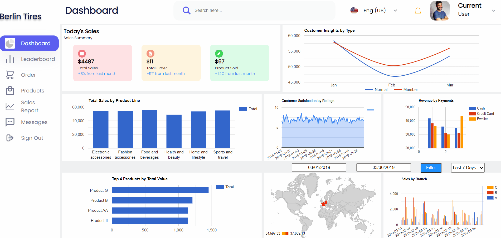
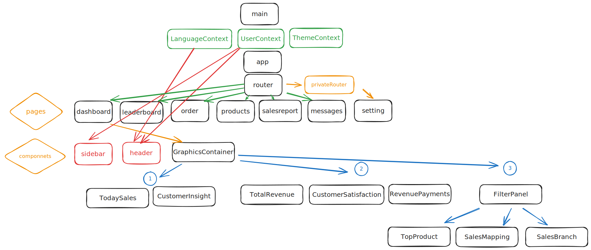

# English

# React Dashboard Project

This project is a React application created using [Vite](https://vitejs.dev/). Vite is a JavaScript tool that provides a fast development experience.



## Getting Started

Clone the project to your local environment:

```bash
git clone https://github.com/IRONSTONE-A/berlintiresdashboard.git
cd berlintiresdashboard
```

## Install the required dependencies

```bash
npm install
```

## Start the project

```bash
npm run dev
```

Visit http://localhost:3000 in your browser to see the application.

## Commands

npm run dev: Starts the application in development mode.
npm run build: Compiles the application for production.
npm run serve: Runs the compiled application on a local server.

## Project Structure



## Deployment to a Server

To deploy the project on a server, follow these general steps. However, some steps may vary depending on the server and environment you are using.

## Connect to the Server

Connect to the server where you will deploy the project using SSH or another method. For example, to connect using SSH:

```bash
ssh username@server-ip-address
```

## Upload Project Files to the Server

Copy the project from your computer to the server. You can use tools like SFTP or SCP, or use the rsync command to copy files.

```bash
rsync -avz -e "ssh" /local/project/directory username@server-ip-address:/server/project/directory
```

Here, /local/project/directory represents the directory of your project on your computer, and /server/project/directory represents the target directory on the server.

### Install Required Dependencies on the Server

Install the necessary dependencies for your project on the server.

```bash
cd /server/project/directory

curl -o- https://raw.githubusercontent.com/nvm-sh/nvm/v0.39.1/install.sh | bash
nvm install node
sudo apt auto-remove nodejs
nvm install v16
nvm use v16

npm install

```


## Start or Build the Project on the Server

Perform the steps to start the project or build for the production environment.

```bash
npm run build
```

### Run the Project on the Server

```bash
npm start
```

### Firewall and Port Settings

Check the firewall settings on the server and ensure that the port on which the project runs is open. Make sure the port on which you are running the project is open on the server.

# Türkçe 

# React Dashboard Projesi

Bu proje, [Vite](https://vitejs.dev/) kullanılarak oluşturulmuş bir React uygulamasıdır. Vite, hızlı bir geliştirme deneyimi sunan bir JavaScript aracıdır.


## Başlangıç

Projeyi yerel ortamınıza klonlayın:

```bash
git clone https://github.com/IRONSTONE-A/berlintiresdashboard.git
cd berlintiresdashboard

```

## Gerekli bağımlılıkları yüklemek için

```bash
npm install
```

## Projeyi başlatmak için

```bash
npm run dev
```

Tarayıcınızda http://localhost:3000 adresine giderek uygulamayı görebilirsiniz.

## Komutlar

npm run dev: Geliştirme modunda uygulamayı başlatır.
npm run build: Uygulamayı üretim için derler.
npm run serve: Üretilen uygulamayı yerel bir sunucuda çalıştırır.

## Proje Yapısı


## Sunucuya Yükleme

 Projeyi bir sunucu üzerinde deploy etmek için  birkaç adım izlemeniz gerekmektedir. Aşağıda, projenizi bir sunucuya deploy etmek için sırasıyla izlemeniz gereken genel adımları gösteren talimat bulunmaktadır. Ancak, kullanacağınız sunucu ve ortama bağlı olarak bazı adımlar değişebilir.

### Sunucuya Bağlanma
Projeyi deploy edeceğiniz sunucuya SSH veya başka bir yöntemle bağlanın. Örneğin, SSH kullanarak bağlanmak için:

```bash
ssh kullanici@sunucu-ip-adresi
```

### Proje Dosyalarını Sunucuya Yükleme
Projeyi bilgisayarınızdan sunucuya kopyalayın. SFTP veya SCP gibi araçlar kullanabilirsiniz, ya da rsync komutunu kullanarak dosyaları kopyalayabilirsiniz.

```bash
rsync -avz -e "ssh" /local/proje/dizini kullanici@sunucu-ip-adresi:/sunucu/proje/dizini
```

Burada /local/proje/dizini bilgisayarınızdaki projenin dizinini, /sunucu/proje/dizini ise sunucudaki hedef dizini temsil eder.

### Sunucuda Gerekli Bağımlılıkları Yükleyin

Sunucuda projeniz için gerekli bağımlılıkları yükleyin. 

```bash
cd /sunucu/proje/dizini
npm install
```

### Projeyi Başlatma veya Derleme

Projeyi başlatma veya üretim ortamı için derleme yapma adımlarını gerçekleştirin. 

```bash
npm run build
```

### Sunucuda Projeyi Başlatma

```bash
npm start
```

### Firewall ve Port Ayarları

Sunucu üzerindeki güvenlik duvarı (firewall) ayarlarını ve projenin çalıştığı portun açık olduğunu kontrol edin. Projeyi hangi port üzerinde çalıştırıyorsanız, o portun sunucu üzerinde açık olduğundan emin olun.