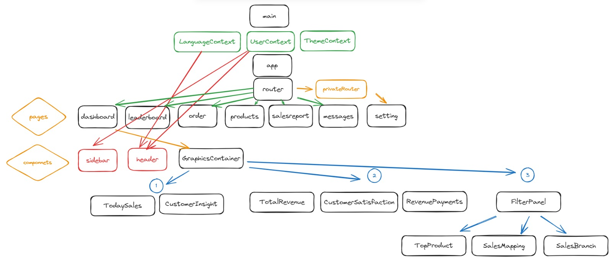

# React Dashboard Projesi

Bu proje, [Vite](https://vitejs.dev/) kullanılarak oluşturulmuş bir React uygulamasıdır. Vite, hızlı bir geliştirme deneyimi sunan bir JavaScript aracıdır.

## Başlangıç

Projeyi yerel ortamınıza klonlayın:

```bash
git clone https://github.com/kullanici_adi/react-proje.git
cd react-proje

```

## Gerekli bağımlılıkları yüklemek için

```bash
npm install
```

## Projeyi başlatmak için

```bash
npm run dev
```

Tarayıcınızda http://localhost:3000 adresine giderek uygulamayı görebilirsiniz.

## Komutlar

npm run dev: Geliştirme modunda uygulamayı başlatır.
npm run build: Uygulamayı üretim için derler.
npm run serve: Üretilen uygulamayı yerel bir sunucuda çalıştırır.

## Proje Yapısı

